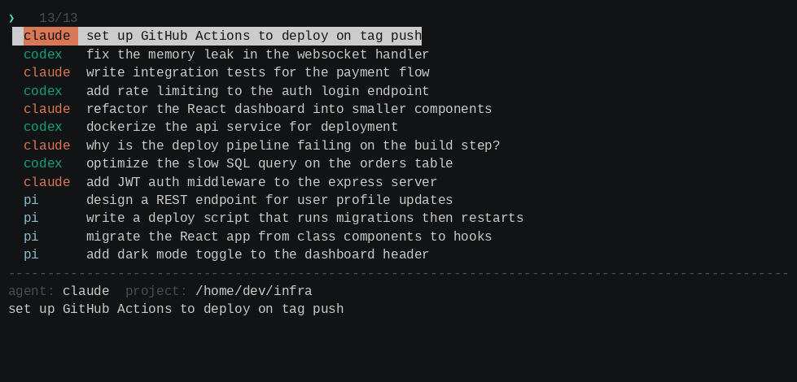

<div align="center">

# zehn

*ذهن — "the mind"*

Find any prompt you have ever typed to an AI coding agent, then drop back into that session.



[Install](#how-do-i-install-it) ·
[Usage](#how-do-i-use-it) ·
[Sources](#where-does-it-look) ·
[Matching](#how-matching-works)


<p>
  Works with
  <a href="https://www.anthropic.com/claude-code"><kbd> Claude Code</kbd></a> &nbsp;
  <a href="https://github.com/openai/codex"><kbd> Codex</kbd></a> &nbsp;
  <a href="https://pi.dev"><kbd> pi</kbd></a> &nbsp;
  <a href="https://opencode.ai"><kbd> opencode</kbd></a>
</p>

</div>

## What is this?

You use claude one day, codex the next, then pi or opencode after that. A week later you want the thing you asked for back then, but you cannot remember which agent you said it to, let alone which project. So you go digging through four different history formats by hand.

zehn reads all of them at once. It pulls every prompt you have sent to claude, codex, pi, and opencode into a single fuzzy-searchable list. You type a few letters, find the prompt, hit Enter, and it puts you back in that exact session in the agent that owns it.

It is one small Zig binary with no runtime dependencies (sqlite3 is optional, and only for opencode). On my machine it reads and parses about 1,300 sessions in roughly 0.2 seconds.

## How do I install it?

One line, macOS or Linux:

```sh
bash <(curl -L https://al3rez.com/zehn)
```

It clones the repo, does a `ReleaseFast` build, and leaves the binary at `~/.local/bin/zehn`. If you don't already have [Zig 0.16+](https://ziglang.org/download/), it grabs it for you — via `brew`/`pacman` when present, otherwise the official tarball from ziglang.org. Set `PREFIX` to install somewhere else (`PREFIX=/usr/local bash <(curl -L ...)`), or `NO_INSTALL_ZIG=1` to make it refuse rather than fetch Zig.

Prefer to do it by hand? You'll need [Zig 0.16](https://ziglang.org/download/) or newer.

```sh
git clone https://github.com/al3rez/zehn && cd zehn
zig build -Doptimize=ReleaseFast --prefix ~/.local
```

Either way, make sure `~/.local/bin` is on your `PATH`. If you would rather not install it anywhere, the build also leaves a copy at `zig-out/bin/zehn`.

## How do I use it?

Just run it:

```sh
zehn
```

Type to filter. Use the arrow keys or `^p`/`^n` to move. Press Enter on a prompt and zehn `cd`s into that session's project directory and runs the agent's resume command for you. If the project folder is gone, it falls back to your current directory and tells you.

If you do not want it to launch anything, the other modes just print:

```sh
zehn --print     # print the prompt text of whatever you select
zehn --project   # print  agent <tab> project <tab> text
zehn --list      # dump everything, no UI
zehn --version
```

Keys: type to filter, `↑`/`↓` or `^p`/`^n` to move, Enter to pick, Esc or `^c` to quit.

Some prompts are worth keeping around. Press `^f` to favorite the selected one — it
gets a `★` and floats to the top of every result list. Favorites live in
`$XDG_CONFIG_HOME/zehn/favorites` (or `~/.config/zehn/favorites`), keyed by a hash of
the prompt so the read-only history files are never touched.

You can also reuse a prompt somewhere other than its origin session. `^y` copies the
selected prompt to the clipboard (via `pbcopy`/`wl-copy`/`xclip`/`xsel`). `^o` forks it:
pick an agent (`1` claude, `2` codex, `3` pi, `4` opencode) and zehn starts a fresh
session there seeded with that prompt — so a prompt you wrote to one agent can be fired
at another.

## Where does it look?

| Agent    | History location                               | Resume command            |
|----------|------------------------------------------------|---------------------------|
| claude   | `~/.claude/history.jsonl`                       | `claude --resume <id>`    |
| codex    | `~/.codex/history.jsonl`                        | `codex resume <id>`       |
| pi       | `~/.pi/agent/sessions/*/*.jsonl`               | `pi --session <id>`       |
| opencode | `~/.local/share/opencode/opencode.db` (SQLite) | `opencode --session <id>` |

Each agent shows up in its own brand color, so you can tell at a glance whether a result came from claude or codex. Duplicate prompts collapse into one (keeping the most recent), and when two results score the same, the newer one wins.

opencode keeps its history in a SQLite database, so reading it needs the `sqlite3` CLI on your `PATH`. If it is missing, zehn skips opencode and says so instead of failing.

## How matching works

The search is not a plain substring filter. It is an fzf-style optimal alignment: a Smith-Waterman variant with affine gap penalties and extra credit for letters that land on word boundaries, camelCase humps, or in an unbroken run. In practice that means typing `auth` surfaces "add **auth** middleware" above some prompt where a, u, t, h happen to be scattered across the line.

"Optimal" is not a marketing word here. A test runs the matcher against a brute-force reference over thousands of random inputs and checks that the scores come out identical.

## Development

```sh
zig build test            # unit tests: matcher + all four parsers
zig build run -- --list
```

The matcher lives in `src/fuzzy.zig`, the per-agent parsers in `src/scan.zig`, and the terminal UI in `src/tui.zig`.

## Origin of the name

zehn (ذهن) means "the mind" in Persian and Arabic. It is short, it is easy to say (close to "zen"), and a tool whose whole job is remembering what you said to which agent might as well be named after memory.

## License

[PolyForm Noncommercial 1.0.0](LICENSE). Free to use, modify, and share for any
noncommercial purpose (personal projects, research, nonprofits, education).
Commercial use needs a separate license — open an issue or reach out.
